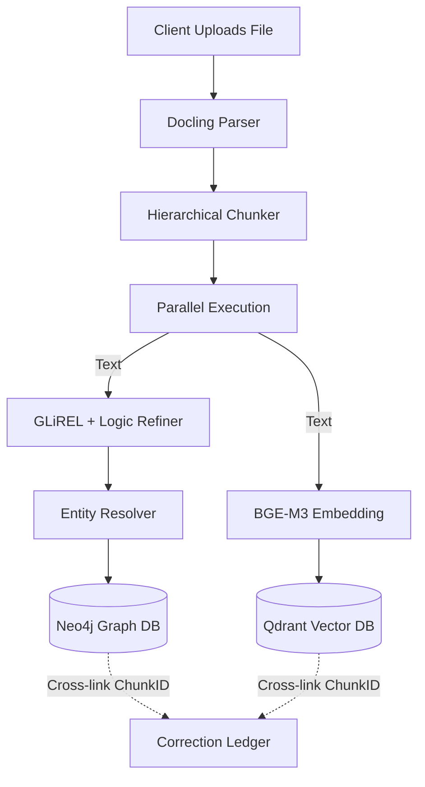
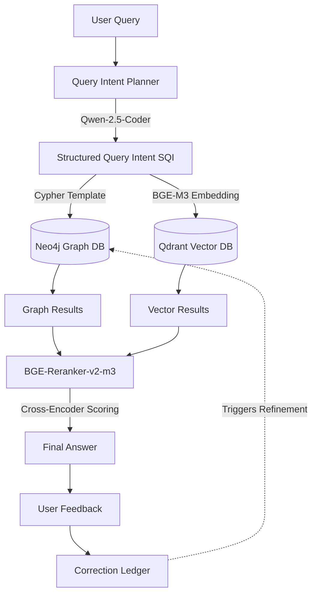

# SentinelVault Architecture

SentinelVault is a **Local-First, High-Integrity Knowledge Orchestration Pipeline**. It is designed to transform unstructured documents into a Property Knowledge Graph and Multi-Vector Space without relying on any external LLM APIs. The system leverages multi-stage entity resolution, logic-refined extraction, and intent-based query planning.

---

## 🚀 Core Features

1. **Local-First Inference:** All extraction, reasoning, embedding, and reranking processes run locally. Zero reliance on OpenAI, Anthropic, or external services.
2. **Dual-Layer Extraction Pipeline:** Combines blazing-fast zero-shot relation tagging (GLiREL) with local LLM logical reasoning (`Qwen-2.5-7B-Instruct-AWQ`) to resolve implicit relationships and long-range dependencies.
3. **Multi-Stage Entity Resolution:** A strict four-stage deduplication pipeline (Normalization -> Blocking -> Semantic Similarity -> Graph Context) prevents node duplication while preserving intentional disambiguation.
4. **Intent-Based Query Planning:** Translates natural language into a Structured Query Intent (SQI) JSON object rather than generating raw Cypher, preventing hallucinations and ensuring safe graph traversals. Shares the central AWQ LLM to save VRAM.
5. **Cross-Encoder Reranking:** Merges results from sparse graph context and dense vector search, scoring the combined set using a cross-encoder (BGE-Reranker-v2-m3) to prevent RRF bias.
6. **Correction Ledger:** Maintains a full audit trail for confidence metadata, user feedback, and correction signals to drive continuous refinement.
7. **Strict Execution & Hardware Validation:** Enforces an 8GB VRAM limit and halts operation if unsupported. Contains zero "fallback" or mock generation logic—all ML inference and JSON parsing is executed with strict error handling.

---

## 🛠️ Technology Stack & Tools

* **Core Orchestration:** `.NET 10` core service communicating via `gRPC`.
* **API Layer:** `FastAPI` (Python) managing endpoints and orchestrating the data flows.
* **Document Parsing:** `Docling` to extract layout-aware Markdown and preserve structural hierarchy.
* **Logic Extraction:** `GLiREL` (zero-shot extraction) + `Qwen-2.5-7B-Instruct-AWQ` (local LLM reasoning, pre-quantized to 4-bit).
* **Query Planner:** Shares the central `Qwen-2.5-7B-Instruct-AWQ` instance to prevent VRAM exhaustion.
* **Embeddings:** `BGE-M3` (1024-dimensional dense vectors).
* **Reranker:** `BGE-Reranker-v2-m3` (cross-encoder).
* **Graph Database:** `Neo4j` (running locally via Docker) to store the Property Knowledge Graph.
* **Vector Database:** `Qdrant` (running locally via Docker) to store and query dense semantic vectors.
* **Data Validation:** `Pydantic v2` enforcing cybersecurity and B2B domain ontologies.

---

## 📐 Architecture Data Flows

### 1. The Ingestion Pathway (`/ingest`)

When a document is uploaded, it passes through a rigorous sequence of local models before landing in the databases.

### 2. The Hybrid Retrieval Pathway (`/query`)

When a user asks a question, the Query Planner constructs an execution intent.

---

## 📂 System Component Breakdown

| File | Purpose |
| :--- | :--- |
| `api.py` | FastAPI entry point. Manages gRPC streams with the .NET 10 core service. Enforces fail-fast error handling and routes requests. |
| `document_parser.py` | Wraps `Docling` to extract layout-aware Markdown. Outputs structured chunks anchored to their context (section path, page, heading depth). |
| `logic_extractor.py` | Dual-layer extraction pipeline. Runs `GLiREL` followed by `Qwen-2.5-7B-Instruct-AWQ` for implicit relationship reasoning. Validates triples strictly. |
| `entity_resolver.py` | Four-stage deduplication pipeline (Normalization, Blocking, Semantic Similarity via BGE-M3, Graph Context via Neo4j). |
| `query_planner.py` | Converts queries into a Structured Query Intent (SQI) using the shared AWQ LLM instance. Maps to pre-validated Cypher templates. |
| `database_service.py` | Async transaction manager for Neo4j and Qdrant. Handles BGE-M3 embedding batches and maintains cross-links. |
| `reranker_service.py` | Uses `BGE-Reranker-v2-m3` to merge and score candidate sets from Neo4j and Qdrant. |
| `audit_logger.py` | Manages the Correction Ledger. Persists extraction confidence metadata, user correction signals, and maintains an audit trail. |
